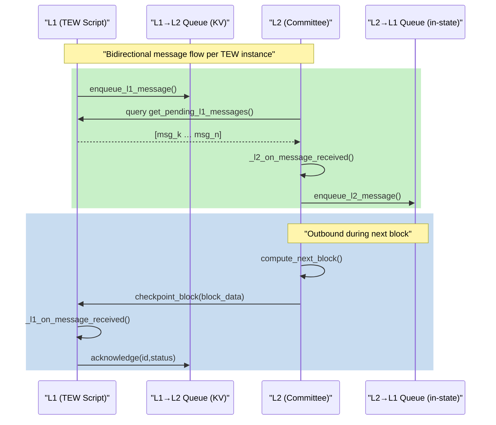

# TEW Queue – Generic Message Passing Specification v0.1-B

> **Status:** Draft  
> **Supersedes:** _none (first standalone queue spec)_  
> **Aligned With:** TEW Protocol v0.5  
> **Scope:** Python / Dyslang implementation running inside DysVM (no protobuf, no IBC)

---

## 0 · Scope & Purpose

TEW Queue (“TewQueue”) defines a **simple, bidirectional, reliable message channel** between the on-chain **Layer-1 (L1) TEW script** and the off-chain **Layer-2 (L2) committee**.  
It sits alongside the existing TEW block-gossip mechanism and is intentionally minimal: only Python data structures, deterministic JSON, and KV storage; no protobuf, no external transport.

Key objectives:
1.  **Generic** – payloads are opaque to the framework; each TEW App chooses semantics.
2.  **Reliable** – messages persist until acknowledged or timed-out.
3.  **Ordered** – strict FIFO per direction using monotonic IDs.
4.  **Deterministic** – every state mutation is part of the TEW state hash.
5.  **Easy to implement** – pure Python helpers callable from Dyslang.

---

## 1 · High-Level Architecture



*   **Storage Truth:**
    *   `QL1` entries live in the on-chain KV store under the script's namespace.
    *   `QL2` entries live inside `l2_state.meta.pending_messages` until checkpointed.
*   **Consensus Coupling:**  Every checkpoint embeds the exact set of L2→L1 messages plus the ID of the **latest processed L1 message**, guaranteeing deterministic state.

---

## 2 · Message Model

```json
{
  "id": "l1:instance_id:42",      // prefix "l1" or "l2"
  "type": "app_defined",          // free-form short string
  "payload": {"…": "…"},         // arbitrary JSON, app interprets
  "timeout": 123456,               // block-height or 0 = no timeout
  "status": "pending",            // pending | ack | nack | timeout
  "response": null,                // app-set on ACK/NACK
  "created_at": 123450             // L1 block height when created
}
```

* IDs are **monotonic integers** per direction, scoped by instance.  
  * Generated format: `"l1:{instance_id}:{seq}"`  or  `"l2:{instance_id}:{seq}"`.
* `timeout == 0` means "never expire".  A non-zero value is a block-height **absolute deadline**.
*  A message whose deadline is ≤ current L1 block at checkpoint time auto-nacks with reason `timeout`.

---

## 3 · Storage Layout (per instance)

| Key Pattern | Purpose | Value |
|-------------|---------|-------|
| `tew/{id}/queue/l1_to_l2/{msg_id}` | L1→L2 message objects | Full message JSON |
| `tew/{id}/l2/latest_l1_cursor` | Highest L1 msg ID processed by L2 | `{"last_id": "l1:…"}` |
| `l2_state.meta.pending_messages` | Array of L2→L1 msgs not yet ACKed | list[Message] |

> Only these three touch points are required; everything else is helper sugar.

---

## 4 · Helper API (Python)

### 4.1 L1-side (runs inside script tx context)

```python
from tew_queue import enqueue_l1_message, mark_l1_messages_up_to

# enqueue new outbound msg
msg_id = enqueue_l1_message(instance_id, msg_type, payload, timeout=0)

# during checkpoint processing
mark_l1_messages_up_to(instance_id, last_processed_msg_id, acks_map)
```

* `acks_map` = `{msg_id: {"status": "ack"|"nack", "response": {...}}}`.

### 4.2 L2-side (runs inside compute_next_block sandbox)

```python
from tew_queue import fetch_new_l1_messages, enqueue_l2_message, timeout_expired_messages

new_msgs = fetch_new_l1_messages(state)
for m in new_msgs:
    _l2_on_message_received(state, m)

# create outbound
enqueue_l2_message(state, "withdrawal_approved", {"user": user, "amount": amt})

# auto-nack any expired inbound/outbound
timeout_expired_messages(state)
```

All helpers mutate `state` or KV deterministically, ensuring identical results across committee members.

---

## 5 · Checkpoint / Consensus Rules

1. Signed-Tx data for block **N** MUST include:
    * Regular `Tx Data` fields (per TEW v0.5).
    * `l1_messages` – the JSON array returned by `fetch_new_l1_messages(state)` **before** applying txs.
2. `compute_next_block` MUST:
    1. Verify that `l1_messages` exactly equals the messages fetched via the helper (consensus safety).
    2. Apply app txs and queue operations.
    3. Append any `pending_messages` (L2→L1) into `next_state.meta.pending_messages`.
    4. Increment `state.meta.last_processed_l1_message` to the highest ID processed in this block.
3. `checkpoint_block` (L1) MUST:
    1. Move any `pending_messages` into KV as `l2_to_l1` ACK-awaiting entries.
    2. Mark L1 messages up to the cursor as `ack` unless the cursor skipped IDs (then `nack`).
    3. Auto-nack anything whose `timeout` expired.

---

## 6 · Callbacks (Application Layer)

| Hook | When Called | Typical Use |
|------|-------------|-------------|
| `_l1_on_message_received(instance_id, msg)` | During `checkpoint_block`, for each new L2→L1 msg | execute withdrawals, emit events |
| `_l1_on_message_ack(instance_id, msg_id, response)` | After ACK | update UI, internal cleanup |
| `_l1_on_message_nack(instance_id, msg_id, reason)` | After NACK/timeout | retry or surface error |
| `_l2_on_message_received(state, msg)` | In sandbox, before tx execution | update balances, params |
| `_l2_on_message_ack(state, msg_id, response)` | On ACK from L1 | clear pending, record success |
| `_l2_on_message_nack(state, msg_id, reason)` | On NACK/timeout | revert, alert user |

Implementations may leave hooks empty if not needed.

---

## 7 · Example Flow (Deposit Notification)

1. **Alice deposits 50 DYS.**  L1 script calls:
```python
enqueue_l1_message(
    "channel_001", "deposit_notification",
    {"user": alice, "amount": 50_000_000}, timeout=0)
```
2. **Block N off-chain**
    * Committee queries `get_pending_l1_messages()` → receives msg ID `l1:channel_001:7`.
    * `compute_next_block` triggers `_l2_on_message_received`, updates L2 balances, sets `last_processed_l1_message = …:7`.
    * Adds no outbound messages.
3. **Checkpoint block N** – L1 sees cursor `…:7`; marks message **ACK** and invokes `_l1_on_message_ack`.

---

## 8 · Timeout Behaviour

For every block checkpointed:
1. Inspect all un-ACKed L2→L1 messages whose `timeout` ≠ 0 and `timeout ≤ current_height`.  
   Change `status → "timeout"`; invoke `_l2_on_message_nack` (off-chain consensus) and `_l1_on_message_nack` during checkpoint.
2. Similarly, L1→L2 messages still `pending` after timeout are NACKed by L1.

---

## 9 · Security Considerations

* **Authentication** – Only committee members can embed `l1_messages` slice in signed-tx; existing TEW signature checks apply.
* **Replay Protection** – Strict monotonic IDs + inclusion in state hash prevent duplicate processing.
* **Denial of Service** – Apps must bound queue length or introduce fees; spec leaves policy to app.
* **Data Volatility** – Queue items are part of the deterministic state, so conflicting forks will naturally roll back.

---

## 10 · Implementation Checklist

* [ ] Add `tew_queue.py` helpers (L1 + L2).  
* [ ] Integrate helpers into TEW Thunder deposit/withdrawal flow.  
* [ ] Update `compute_next_block` & `checkpoint_block` templates in TEW Framework.  
* [ ] Write unit tests covering enqueue, ack, nack, timeout.

---

*End of TEW Queue Specification v0.1-B* 