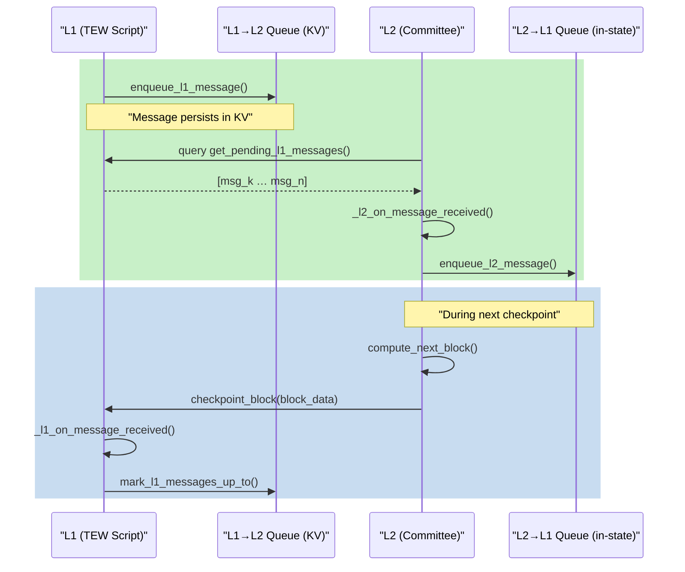

# TEW Queue – Reliable Bidirectional Message Bus  
**Version:** 0.2 (targets TewProtocol v0.5)  
**Status:** Draft  

> This document supersedes v0.1-A and v0.1-B.  
> It *removes built-in time-out handling* – timeouts are now entirely an **application-level concern** that can be implemented by NACKing messages for the chosen reason.  
> The queue is specified purely as an **ordered, durable, bidirectional message bus** assuming a live, honest L1 and L2 environment.

---

## 0 · Scope & Purpose
TewQueue provides a **minimal, deterministic** mechanism for passing structured messages between:

* **Layer-1 (L1)** – the on-chain TEW application script running inside the Dyson VM.
* **Layer-2 (L2)** – the off-chain committee that cooperatively computes and checkpoints L2 blocks.

Key goals:

1. **Generic** – payload semantics are defined by each TEW App.
2. **Reliable & Ordered** – FIFO ordering per direction via monotonically increasing IDs.
3. **Deterministic** – all state mutations are covered by the TewProtocol v0.5 hash commitments (`prev_state_hash`).
4. **Minimal** – no additional consensus vectors, protobuf, or IBC; just Python helpers & KV storage.

The specification **assumes** both layers are live and that committee members behave honestly. Fault-tolerance, extended liveness guarantees, and anti-Sybil measures are outside this document's scope.

---

## 1 · High-Level Architecture



* **Storage Truth**
    * `QL1` entries live in the on-chain KV under the script's namespace.
    * `QL2` entries live **inside** `l2_state.meta.pending_messages` until checkpointed.

---

## 2 · Data Model

### 2.1 Message Object

```json
{
  "id": "l1:instance_id:42",        // direction-prefixed, monotonic per origin
  "type": "app_defined",             // free-form application label
  "payload": { "…": "…" },           // arbitrary JSON
  "status": "pending",               // pending | ack | nack
  "response": null,                   // set on ACK/NACK
  "created_at": 123450                // L1 block height when created
}
```

> **No timeout field** – applications may include such metadata inside `payload` if desired and perform NACKs accordingly.

### 2.2 Storage Layout (per instance‐id)

| Key | Purpose | Value |
|-----|---------|-------|
| `tew/{id}/queue/l1_to_l2/{msg_id}` | L1→L2 message objects | full JSON object |
| `tew/{id}/l2/latest_l1_cursor`     | Highest L1 msg ID processed by L2 | `{ "last_id": "l1:…" }` |
| `l2_state.meta.pending_messages`   | L2→L1 messages awaiting ACK | list[Message] |

---

## 3 · Helper API  
*(Reference signatures – implemented in `tew_queue.py`)*

### 3.1 L1-Side Helpers (Transaction context)

```python
from typing import Dict, List, TypedDict, Literal, Optional

MessageStatus = Literal["pending", "ack", "nack"]

class Message(TypedDict):
    """Typed dictionary for a queue message."""

    id: str
    type: str
    payload: Dict[str, object]
    status: MessageStatus
    response: Optional[Dict[str, object]]
    created_at: int

# -------------------------------------------------------------

def enqueue_l1_message(
    instance_id: str,
    msg_type: str,
    payload: Dict[str, object]
) -> str:
    """Insert a new **L1→L2** message into KV storage and return its ID.

    Preconditions
    ------------
    • Must be executed in an L1 transaction context.
    • Caller is trusted script code (not committee).
    """
    ...


def mark_l1_messages_up_to(
    instance_id: str,
    last_processed_msg_id: str,
    results: Dict[str, Dict[str, object]] | None = None,
) -> None:
    """Batch-ACK all L1→L2 messages **≤** `last_processed_msg_id`.

    Parameters
    ----------
    instance_id
        TEW instance identifier.
    last_processed_msg_id
        Highest message ID that L2 claims to have processed.
    results
        Optional mapping `{msg_id: {"status": "ack"|"nack", "response": {...}}}`.
        Messages absent from this dict default to `{"status": "ack", "response": null}`.
    """
    ...
```

### 3.2 L2-Side Helpers (Sandbox context)

```python
from typing import List, Dict


def fetch_new_l1_messages(state: Dict[str, object]) -> List[Message]:
    """Return all **pending** L1→L2 messages with ID greater than
    `state.meta.latest_l1_cursor`.
    """
    ...


def enqueue_l2_message(
    state: Dict[str, object],
    msg_type: str,
    payload: Dict[str, object]
) -> None:
    """Append a **L2→L1** message to `state.meta.pending_messages`.

    Ordering is preserved; IDs follow the `l2:instance_id:<seq>` scheme.
    """
    ...
```

> Helper bodies are deterministic and **must not** access external state beyond `state` and KV-queries permitted in read-only context.

### 3.3 Callback Stubs (Application overrides)

| Hook | When Called | Typical Use |
|------|-------------|-------------|
| `_l1_on_message_received(instance_id, msg)` | During `checkpoint_block` for each new L2→L1 msg | execute withdrawals, emit events |
| `_l1_on_message_ack(instance_id, msg_id, response)` | After ACK | update UI |
| `_l1_on_message_nack(instance_id, msg_id, reason)` | After NACK | retry or audit |
| `_l2_on_message_received(state, msg)` | Inside `compute_next_block` before tx execution | update balances |
| `_l2_on_message_ack(state, msg_id, response)` | On ACK from L1 | clear pending |
| `_l2_on_message_nack(state, msg_id, reason)` | On NACK | revert local changes |

Each hook **MAY** be a no-op if an app does not require that signal.

---

## 4 · Consensus & Checkpoint Rules
1. **Signed-Tx Composition** – Each committee member's `Signed Tx` for block *N* **MUST** embed an array field `l1_messages` that is *exactly* the result of `fetch_new_l1_messages(state)` **before** applying L2 txs.
2. **Deterministic Compute** – `compute_next_block` MUST:
   1. Verify byte-for-byte equality between supplied `l1_messages` and a freshly fetched copy.
   2. Call `_l2_on_message_received` on each message.
   3. Apply user txs, possibly invoking `enqueue_l2_message`.
   4. Produce `next_state` with an updated `meta.pending_messages` list and incremented `latest_l1_cursor`.
3. **Checkpoint Processing** – On L1, `checkpoint_block` MUST:
   1. Persist all L2→L1 `pending_messages` into KV (`l2_to_l1`) and clear the list in state.
   2. Invoke `_l1_on_message_received` for each.
   3. Call `mark_l1_messages_up_to` to ACK prior L1→L2 messages.

Because all queue mutations become part of `next_state`, they are automatically covered by TewProtocol's `next_state_hash` without adding new consensus vectors.

---

## 5 · Edge-Case Notes
The following edge cases are recognised but **delegated to application logic or future specs**:

* **Extended Checkpoint Gaps** – If L2 fails to checkpoint for many blocks, messages simply remain `pending`. Apps should design for this eventuality.
* **Namespace Exhaustion** – Apps should prune or archive acknowledged messages to avoid unbounded KV growth.
* **Partial ACK Scenarios, Fork Handling, Committee Churn** – out of scope for v0.2.

---

## 6 · Security Considerations (Informative)
* Only script code may enqueue **L1→L2** messages; only committee (via L2 code) may enqueue **L2→L1** messages.
* Monotonic IDs and inclusion in `next_state_hash` protect against replay attacks.
* Denial-of-Queue (spam) mitigation, Sybil assumptions, and liveness beyond honest-majority are left to future work.

---

## 7 · Implementation Checklist
- [ ] Add/Update `tew_queue.py` helpers per API in §3.
- [ ] Integrate `l1_messages` parameter in `Signed Tx` creation logic.
- [ ] Update `compute_next_block` template in TewFramework to invoke queue helpers.
- [ ] Enhance `checkpoint_block` to persist and ACK messages.
- [ ] Write unit tests: enqueue → receive (both directions) and ACK happy-path.

---

*End of TEW Queue Specification v0.2* 