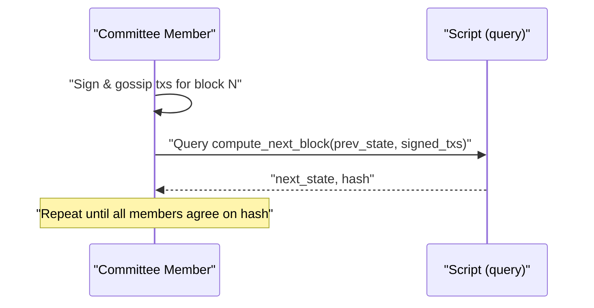

# DysonProtocol L2 – **TewProtocol Specification v0.6**

> **Status:** Draft (supersedes v0.5)
>
> **v0.6 Changes**: This version removes all "app" and "framework" layers.  The protocol is now defined **entirely in terms of a single DysonProtocol script** that runs on L1 and a committee of off-chain L2 peers.  The only on-chain state is periodic, irregular checkpoints submitted by the committee.  Each L2 block's metadata contains `l1_block_info`, a reference height that deterministic L2 code may query via `_query`.

---

## 0 · Scope & Purpose

This document specifies the **TewProtocol**, an L1/L2 consensus mechanism for deterministic Proof-of-Authority (PoA) applications on the Dyson Protocol blockchain.  All logic—both L1 and L2—lives inside **one DysonProtocol script**.  Off-chain peers hold the authoritative state between checkpoints; L1 serves solely as a data-availability and arbitration layer.

Key principles:

1. **Script-Centric Design** – There is no separate "framework" or "app" layer.  A deployed script is self-contained and authoritative.
2. **Two-Plane Architecture** – L1 executes transactions that mutate state; L2 peers execute read-only queries to compute future state.
3. **Irregular Checkpoints** – L2 state is checkpointed on-chain only when needed (e.g.
   dispute, synchronisation).  Between checkpoints, off-chain peers store state locally.
4. **Deterministic Execution** – Identical inputs at L1 and L2 must yield identical results.
5. **Hash Commitment** – Every L2 block signs the hash of the previous state rather than the full object, minimising gossip payloads.

---

## 1 · Architecture Overview

### 1.1 Two-Plane Architecture

| Plane | Ownership | Purpose |
|-------|-----------|---------|
| **Layer-1 (L1)** | On-chain script | Arbitration, data availability, persistence of checkpoints |
| **Layer-2 (L2)** | Committee peers | High-throughput block production & state storage |

### 1.2 Deployment Model

```
DysonProtocol Script (single file)
├── L1 entry-point functions (checkpoint_block, terminate, etc.)
└── L2 deterministic functions (compute_next_block, helpers)
```

• The script is deployed once.  All state keys are namespaced under the script's address.
• Committee members run off-chain daemons that gossip signed L2 transactions and call `compute_next_block` via `query script run`.

### 1.3 L2 Block Metadata

Each L2 state object (see §2.3) includes `l1_block_info`, capturing height & hash of the L1 block that the committee considered current when producing that L2 block.  L2 deterministic code MAY perform `_query` calls *read-only* at that exact height; it MUST NOT query future blocks.

### 1.4 Instance Lifecycle (Generic)

```mermaid
sequenceDiagram
    participant U as "User"
    participant L1 as "Script (L1)"
    participant L2 as "Committee (L2)"

    Note over U,L2: "Instance Lifecycle"

    rect rgb(38, 56, 40)
        Note over U,L1: "1. Initialization"
        U->>L1: "init_instance(config)"
        L1-->>U: "Instance created"
    end

    rect rgb(38, 56, 40)
        Note over L2: "2. Off-chain Blocks"
        loop Blocks 1-N
            L2->>L2: "Gossip signed txs"
            L2->>L1: "Query: compute_next_block()"
            L1-->>L2: "next_state, next_state_hash"
        end
    end

    rect rgb(38, 56, 40)
        Note over L2,L1: "3. Checkpoint (irregular)"
        L2->>L1: "TX: checkpoint_block(BlockData)"
        L1-->>L2: "State persisted on-chain"
    end

    rect rgb(38, 56, 40)
        Note over U,L1: "4. Termination"
        U->>L1: "terminate_instance()"
        L1->>U: "Balances returned / resources freed"
    end
```



---

## 2 · TewProtocol Specification

### 2.1 Core Protocol Invariants

1. **Sequential Blocks** – L2 block numbers increase by exactly one.
2. **Committee Unanimity** – A valid block contains a signed tx from every committee member.
3. **Deterministic State** – Given identical inputs, `compute_next_block` must yield the same state on every peer.
4. **Timeout Safety** – Any peer may force on-chain execution if off-chain consensus stalls.
5. **Deterministic Hashing** – State hashes use compact-sorted JSON (RFC-8785) so L1 and L2 reproduce the same digest.

### 2.2 Storage Schema (On-Chain Only)

```
tew/{instance_id}/l1/meta                     # Instance metadata
tew/{instance_id}/l2/latest_block_hash        # Hash of latest off-chain state
tew/{instance_id}/l2/blocks/{block:010d}      # Checkpointed BlockData objects (sparse)
```

All other state lives solely with L2 peers until checkpointed.

### 2.3 Data Structures (v0.6)

#### 2.3.1 `L2 State`

```jsonc
{
  "meta": {
    "instance_id": "example_001",
    "block_height": 42,
    "committee": ["dys1alice…", "dys1bob…"],
    "l1_block_info": {"height": 123456, "hash": "0xABC…"}
  },
  "data": {/* arbitrary deterministic JSON */},
  "tx_results": {"dys1alice…": {"success": true}}
}
```

#### 2.3.2 `Tx Data`

```jsonc
{
  "instance_id": "example_001",
  "l2_block_height": 43,
  "prev_state_hash": "sha256:deadbeef…",
  "msgs": ["do_something(123)"]
}
```

#### 2.3.3 `Signed Tx` & 2.3.4 `Signed Txs`
*Unchanged from v0.5; see Appendix A for ADR-036 verification.*

#### 2.3.5 `BlockData`

```jsonc
{
  "prev_state": {/* full L2 State */},
  "prev_state_hash": "sha256:…",
  "signed_txs": {/* committee txs */},
  "next_state": {/* full L2 State */},
  "next_state_hash": "sha256:…"
}
```

### 2.4 Function Execution

| Context | Function Type | Mutates Chain? |
|---------|---------------|----------------|
| **L1**  | Public entry-points (`checkpoint_block`, `progress_block`, `terminate_instance`) | Yes |
| **L2**  | Deterministic helpers (`compute_next_block`, sandboxed `eval`) | No |

### 2.5 Required Public Entry Points

```python
# ── L1 ENTRY POINTS ───────────────────────────────────

def init_instance(config: dict) -> dict:
    """Creates a new instance.  L1 context."""
    pass

def checkpoint_block(instance_id: str, block_data: dict) -> dict:
    """Persists an off-chain agreed block.  L1 context."""
    pass

def progress_block(instance_id: str) -> dict:
    """Forces on-chain execution using submitted txs.  L1 context."""
    pass

def terminate_instance(instance_id: str) -> dict:
    """Terminates an instance and cleans up storage.  L1 context."""
    pass

# ── L2 DETERMINISTIC FUNCTIONS ───────────────────────

def compute_next_block(prev_state: dict, signed_txs: dict) -> dict:
    """Pure function; returns next_state and its hash."""
    pass
```

### 2.6 L2 Execution Flow



---

## 3 · Reference Implementation Sketch

```python
# tew_reference.py – minimal template

def get_state_hash(state: dict) -> str:
    import json, hashlib
    serial = json.dumps(state, sort_keys=True, separators=(",", ":"))
    return "sha256:" + hashlib.sha256(serial.encode()).hexdigest()


def validate_tx_signature(signed_tx: dict):
    # Delegates to _query("/dysonprotocol.script.v1.QueryVerifyTxRequest", …)
    pass


def compute_next_block(prev_state: dict, signed_txs: dict) -> dict:
    # 1. Verify signatures & prev_state_hash
    # 2. Apply txs via sandboxed eval (implementation-specific)
    # 3. Increment block height & embed l1_block_info unchanged
    next_state = prev_state.copy()
    next_state["meta"]["block_height"] += 1
    next_state["tx_results"] = {/* results */}
    h = get_state_hash(next_state)
    return {"next_state": next_state, "next_state_hash": h}
```

---

## Appendix A: Dyslang & Dyson Queries (Updated)

*This appendix mirrors v0.5 but removes any app-specific examples such as deposits or balances.  All snippets are generic and focus on storage access, signature verification, and block queries.*

---
*End of TewProtocol Specification v0.6* 